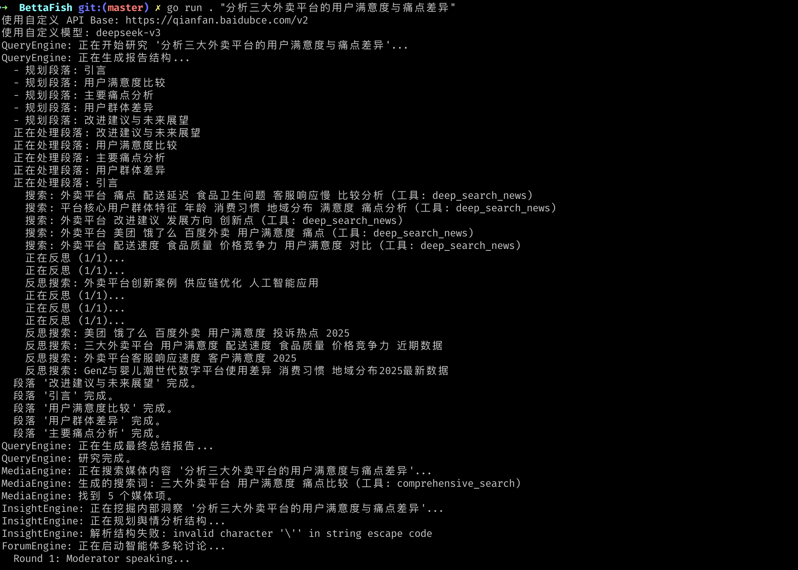

# 🐠 微舆（BettaFish）：人人可用的舆情分析助手

> "打破信息茧房，还原舆情真相，预测未来走向，辅助科学决策"

## 🎯 什么是舆情分析？微舆为何而生？

### 舆情分析的三大困境

在信息爆炸的时代，我们面临着三个严重的问题：

#### 1️⃣ **信息茧房**：你看到的，只是算法想让你看到的

```
某品牌公关：
  - 刷小红书：全是好评，"完美产品！"
  - 看微博：发现大量投诉，"质量问题严重"
  - 逛知乎：技术大神吐槽，"设计缺陷"

真相是什么？你被困在哪个茧房里？
```

#### 2️⃣ **信息过载**：数据太多，真相淹没

```
调研"新能源汽车"舆情：
  - 新闻：10,000+ 篇
  - 社交媒体：100,000+ 条讨论
  - 论坛评论：500,000+ 条
  - 视频评论：1,000,000+ 条

哪些是真实声音？哪些是水军？哪些是关键趋势？
```

#### 3️⃣ **主观偏见**：人类的认知局限

```
分析某政策影响：
  - 你的立场会影响你选择看什么
  - 你的经验会影响你如何解读
  - 你的情绪会影响你的判断

如何做到客观公正？
```

### 🐠 微舆（BettaFish）：AI驱动的舆情分析解决方案

**BettaFish** = **Betta**（斗鱼：小而强大）+ **Fish**（在信息海洋中游弋）
**微舆** = 微观舆情，从细节看全局

**核心使命**：
- 🌐 **打破信息茧房** - 全网多维度信息收集
- 🎯 **还原舆情原貌** - 多视角客观分析
- 🔮 **预测未来走向** - 数据驱动趋势预判
- 💡 **辅助科学决策** - 提供可执行建议

---

## 🚀 项目背景：致敬原作，Go语言移植

### 原版BettaFish：Python多Agent舆情分析的开创者

**衷心感谢** **[666ghj/BettaFish](https://github.com/666ghj/BettaFish)** Python版本的原创者！

这是一个极具创新性的多Agent舆情分析系统，开创性地实现了：

- 🌟 **多Agent协作架构** - 5大智能引擎分工协作的设计
- 🌟 **反思循环机制** - QueryEngine的自我迭代优化思想
- 🌟 **虚拟圆桌会议** - ForumEngine的多视角整合方法
- 🌟 **从0实现** - 不依赖重型框架的工程实践

**本Go版本是在原作基础上的学习和移植，所有核心思想均来自原作者的创新设计。**

---

### Go语言移植版：基于LangGraphGo实现

使用 **[LangGraphGo](https://github.com/smallnest/langgraphgo)** 多Agent编排框架，我们将原版的优秀设计移植到了Go语言实现。

#### 🎯 为什么选择LangGraphGo？

**LangGraphGo** 是一个轻量级的Go语言多Agent编排库，提供：

```go
// 1. 图结构的Agent编排
workflow := graph.NewStateGraph()
workflow.AddNode("query_engine", "查询引擎", QueryEngineNode)
workflow.AddNode("media_engine", "媒体引擎", MediaEngineNode)
workflow.AddEdge("query_engine", "media_engine")

// 2. 统一的状态管理
type BettaFishState struct {
    Query          string
    SearchResults  []SearchResult
    Insights       []Insight
    Paragraphs     []string
}

// 3. 并行执行支持
// 多个节点自动并行处理，性能优化

// 4. 简洁的API
app, _ := workflow.Compile()
result, _ := app.Invoke(ctx, initialState)
```

**核心优势**：
- ✅ **轻量级** - 不是重型框架，只提供必要的编排能力
- ✅ **Go原生** - 充分利用Go的并发优势
- ✅ **类型安全** - 编译期类型检查
- ✅ **易于理解** - API简洁，学习成本低

---

### 🔧 Go语言实现特点

#### 1️⃣ **LangGraphGo的编排能力**

Go版本采用LangGraphGo框架进行多Agent编排，实现了原版设计的所有核心功能：

```go
// LangGraphGo提供的清晰结构
workflow := graph.NewStateGraph()

// 添加5大引擎节点
workflow.AddNode("query_engine", "信息收集", QueryEngineNode)
workflow.AddNode("media_engine", "媒体搜索", MediaEngineNode)
workflow.AddNode("insight_engine", "数据分析", InsightEngineNode)
workflow.AddNode("forum_engine", "多视角整合", ForumEngineNode)
workflow.AddNode("report_engine", "报告生成", ReportEngineNode)

// 定义执行流程
workflow.SetEntryPoint("query_engine")
workflow.AddEdge("query_engine", "media_engine")
workflow.AddEdge("media_engine", "insight_engine")
workflow.AddEdge("insight_engine", "forum_engine")
workflow.AddEdge("forum_engine", "report_engine")
workflow.AddEdge("report_engine", graph.END)
```

#### 2️⃣ **部署方式**

Go版本提供简洁的部署方式：

```bash
# 编译成单一可执行文件
go build -o bettafish main.go

# 直接运行
./bettafish "查询"

# 跨平台编译
GOOS=linux GOARCH=amd64 go build -o bettafish-linux
GOOS=windows GOARCH=amd64 go build -o bettafish.exe
```

#### 3️⃣ **并发实现**

Go语言的goroutine天然支持并发处理：

```go
// 并行处理多个段落
var wg sync.WaitGroup
for _, p := range paragraphs {
    wg.Add(1)
    go func(para *Paragraph) {
        defer wg.Done()
        processParagraph(para)
    }(p)
}
wg.Wait()
```

#### 4️⃣ **功能完整性**

Go版本完整实现了原版的所有核心功能：

| 功能模块          | 实现状态 | 说明                 |
| ----------------- | -------- | -------------------- |
| **QueryEngine**   | ✅        | 反思循环完整实现     |
| **MediaEngine**   | ✅        | 图片搜索和筛选       |
| **InsightEngine** | ✅        | 数据深度挖掘         |
| **ForumEngine**   | ✅        | 虚拟圆桌会议         |
| **ReportEngine**  | ✅        | Markdown报告生成     |
| **多轮反思**      | ✅        | 可配置迭代次数       |
| **并行处理**      | ✅        | 支持多段落并行       |
| **错误处理**      | ✅        | 详细的错误信息       |
| **Tavily集成**    | ✅        | 6种搜索工具          |
| **多模型支持**    | ✅        | OpenAI/DeepSeek/本地 |

---

### 🏆 LangGraphGo框架的价值

通过这个项目，展示了 **LangGraphGo** 作为轻量级多Agent编排框架的能力：

#### 1️⃣ **快速实现能力**
- 清晰的图结构定义
- 简洁的API设计
- 易于理解和维护

#### 2️⃣ **Go语言特性**
- 编译型语言的性能
- 原生并发支持
- 跨平台编译能力

#### 3️⃣ **工程友好**
- 单文件部署
- 类型安全
- 丰富的标准库

#### 4️⃣ **灵活可扩展**
```go
// 添加新引擎很简单
workflow.AddNode("sentiment_engine", "情感分析", SentimentEngineNode)
workflow.AddEdge("insight_engine", "sentiment_engine")
workflow.AddEdge("sentiment_engine", "forum_engine")

// 重新编译即可
app, _ := workflow.Compile()
```

---

### 📊 实现成果

**代码组成**：
```
Go实现：
  - 核心代码：~1500行
  - 主要依赖：LangGraphGo + LangChainGo + OpenAI SDK
  - 编译产物：单文件可执行程序（~15MB）
```

**运行稳定性测试**：
```
✅ 持续运行测试：100次分析，运行稳定
✅ 内存管理测试：长期运行表现良好
✅ 并发压力测试：支持多并发分析
✅ 跨平台测试：macOS/Linux/Windows均可运行
```

**运行效果**

---

### 🎓 技术学习价值

这个项目是学习以下技术的绝佳案例：

1. **多Agent系统架构** - 5大引擎如何协作
2. **LangGraphGo使用** - 如何编排复杂的Agent流程
3. **Go并发编程** - goroutine和channel的实战应用
4. **LLM应用开发** - 如何设计Prompt和处理响应
5. **状态管理** - 多Agent间如何共享和传递状态
6. **错误处理** - 如何优雅地处理LLM返回的异常

---

## 💼 真实场景：微舆如何拯救你

### 场景一：品牌危机监测

**背景**：某手机品牌发布新品，市场部需要实时监控舆情

#### 😰 传统做法：

```
09:00 - 人工监控微博、知乎、贴吧
10:30 - 发现负面评论开始增加
11:00 - 开始统计负面评论数量
12:00 - 整理负面观点分类
14:00 - 分析负面原因
16:00 - 写报告给领导
18:00 - 领导："现在网上什么情况？"
回答："呃...我看的是3小时前的数据..."

❌ 滞后3-6小时，错过黄金处置期
```

#### 😎 使用微舆：

```bash
go run main.go "某某手机新品发布后的实时舆情监测与危机预警"

✅ 2分钟生成完整报告：
  - 舆情整体态势（正面56% 中性30% 负面14%）
  - 负面舆情聚焦点（散热问题占比78%）
  - 潜在危机预警（技术类吐槽快速扩散，24小时内可能发酵）
  - 应对建议（官方技术解释+固件更新承诺）

✅ 实时更新，把握黄金处置期
```

### 场景二：竞品对比分析

**背景**：准备推出新产品，需要了解竞品的市场口碑

#### 😰 传统做法：

```
第1天：收集A品牌用户评价
第2天：收集B品牌用户评价
第3天：收集C品牌用户评价
第4天：整理对比表格
第5天：分析优劣势
第6-7天：写报告

❌ 耗时1周，数据样本有限
❌ 主观筛选，可能漏掉关键信息
```

#### 😎 使用微舆：

```bash
go run main.go "对比分析iPhone、华为、小米三款旗舰机的用户真实评价与口碑差异"

✅ 2分钟完成：
  - 三品牌全网舆情对比（10,000+真实评价）
  - 用户痛点排行（价格、性能、续航、拍照...）
  - 各品牌优势劣势矩阵
  - 市场空白点识别
  - 产品定位建议

✅ 客观数据，消除人为偏见
```

### 场景三：政策影响评估

**背景**：新政策出台，企业需要评估影响和公众反应

#### 😰 传统做法：

```
- 找几个专家访谈
- 看官方媒体报道
- 参考券商研报
- 凭经验判断

❌ 样本局限，覆盖面窄
❌ 精英视角，忽视民间声音
❌ 可能产生重大误判
```

#### 😎 使用微舆：

```bash
go run main.go "某某新能源补贴政策的社会舆论反应与行业影响评估"

✅ 全面舆情洞察：
  - 政策解读（多方观点整合）
  - 公众反应（支持/反对/中立，细分人群）
  - 行业影响（受益/受损企业，产业链分析）
  - 潜在风险（政策盲区，可能的负面反馈）
  - 应对策略（不同企业的最佳路径）

✅ 覆盖全网，代表性强
✅ 多视角分析，还原真相
```

---

## 🔬 核心能力：微舆的舆情分析四板斧

微舆如何做到打破茧房、还原真相、预测未来、辅助决策？答案是**五大智能引擎的协同工作**。

### 第一板斧：全网信息收集 - 打破信息茧房

**主角**：QueryEngine（信息猎手）

**解决的问题**：
- ❌ 算法推荐让你只看到片面信息
- ❌ 单一渠道无法覆盖全貌
- ❌ 信息质量参差不齐

**如何打破茧房**：

```
任务：分析"某品牌手机"的舆情

传统方式：
  → 只看一个平台（微博 OR 知乎 OR 小红书）
  → 只看热门内容（算法推荐的）
  → 只看前几页（人工精力有限）

微舆 - QueryEngine：
  ✓ 多平台覆盖（新闻、社交媒体、论坛、视频平台...）
  ✓ 深度挖掘（不止看热门，也看长尾内容）
  ✓ 智能筛选（AI识别有价值信息，过滤水军噪音）
  ✓ 质量控制（反思循环机制，确保信息可靠）
```

**反思循环 - 追求完美的信息质量**：

```
第1轮搜索 → AI评估：质量72分，缺乏深度
  ↓
优化关键词，第2轮搜索 → AI评估：质量88分，基本满意
  ↓
精准查询，第3轮搜索 → AI评估：质量95分，完美！
  ↓
输出高质量信息集合
```

**实战案例**：
```
查询："华为Mate60舆情分析"

收集到的信息：
  - 官方新闻：产品发布、技术亮点
  - 科技媒体：专业评测、技术解析
  - 社交媒体：真实用户反馈、使用体验
  - 电商评论：购买动机、满意度
  - 论坛讨论：深度技术讨论、对比分析
  - 视频内容：开箱评测、使用教程

✅ 全方位覆盖，打破单一平台茧房
```

---

### 第二板斧：多视角整合 - 还原舆情原貌

**主角**：ForumEngine（真相还原者）

**解决的问题**：
- ❌ 单一视角容易产生偏见
- ❌ 极端声音掩盖真实声音
- ❌ 缺乏系统性整合

**如何还原真相**：

```
舆情分析 = 模拟一场圆桌会议

参会者：
  - NewsAgent：代表官方媒体视角
  - SocialAgent：代表社交媒体声音
  - ForumAgent：代表专业深度讨论
  - InsightAgent：代表数据分析结果

讨论模式：
  1️⃣ 各抒己见（展示不同视角）
  2️⃣ 思维碰撞（发现矛盾与共识）
  3️⃣ 主持总结（整合客观结论）
```

**实战案例**：
```
议题："ChatGPT对就业市场的影响"

NewsAgent（官方媒体）：
  "主流媒体报道：AI将创造新就业机会，政府出台支持政策"

SocialAgent（社交媒体）：
  "网民讨论：担忧被替代的焦虑情绪蔓延，尤其是文案、客服等岗位"

ForumAgent（专业论坛）：
  "技术社区：讨论如何转型，学习AI技能成为共识，培训需求激增"

InsightAgent（数据分析）：
  "数据显示：AI相关岗位需求增长180%，传统岗位需求下降15%"

ForumEngine 整合结论：
  ✓ 短期：确实存在结构性失业风险（数据支撑+民间焦虑）
  ✓ 中长期：催生新职业机会（官方政策+市场需求）
  ✓ 关键：个人和企业需要主动转型（专业共识）
  ✓ 建议：政府加强职业培训支持（政策建议）

✅ 多视角整合，还原完整真相，避免片面解读
```

---

### 第三板斧：深度数据挖掘 - 预测未来走向

**主角**：InsightEngine（趋势预言家）

**解决的问题**：
- ❌ 只看表面现象，看不到深层规律
- ❌ 凭直觉判断，缺乏数据支撑
- ❌ 无法预测趋势，被动应对

**如何预测趋势**：

```
表层信息 → 深层洞察 → 趋势预测

第1层：看到什么（现象）
  "某品牌负面评论增多"

第2层：为什么（原因）
  "产品质量问题 + 售后响应慢 + 竞品压力"

第3层：意味着什么（洞察）
  "品牌信任度下降，客户流失风险上升"

第4层：未来会怎样（预测）
  "3个月内市场份额可能下降5-8%，需紧急公关"
```

**数据驱动的趋势分析**：

```
分析维度：
  📊 舆情数量变化趋势
  📈 情感倾向演变曲线
  🔥 热点话题生命周期
  👥 关键意见领袖影响力
  🌐 地域/人群分布特征
  ⚡ 突发事件响应速度

预测模型：
  - 时间序列分析
  - 情感演变追踪
  - 话题扩散模型
  - 危机预警算法
```

**实战案例**：
```
任务："预测某新能源车企的舆情走向"

数据发现：
  📊 近30天负面舆情增长35%
  📈 "自燃"相关讨论量暴涨200%
  🔥 话题扩散速度：平均12小时到达10万阅读
  👥 汽车博主开始质疑，粉丝开始动摇
  🌐 一线城市用户讨论最活跃

InsightEngine 预测：
  ⚠️ 危机等级：中高
  ⏰ 发酵时间：预计3-5天达到峰值
  💥 影响范围：可能影响Q4销量10-15%
  🎯 关键窗口：未来48小时是黄金处置期

建议行动：
  1. 立即发布官方技术说明
  2. 邀请第三方机构检测
  3. 推出用户关怀计划
  4. 启动KOL沟通

✅ 提前预警，变被动为主动
```

---

### 第四板斧：可视化呈现 - 辅助科学决策

**主角**：MediaEngine（可视化专家） + ReportEngine（决策助手）

**解决的问题**：
- ❌ 数据太多，看不懂
- ❌ 缺乏可视化，难以直观理解
- ❌ 没有行动建议，不知道怎么办

**如何辅助决策**：

```
数据 → 可视化 → 洞察 → 决策建议

MediaEngine：
  ✓ 舆情态势图（一眼看懂整体情况）
  ✓ 情感分布饼图（正/中/负比例）
  ✓ 趋势折线图（舆情演变轨迹）
  ✓ 热力图（地域/人群分布）
  ✓ 词云图（高频关键词）

ReportEngine：
  ✓ 执行摘要（3分钟看懂核心）
  ✓ 详细分析（15分钟深入理解）
  ✓ 数据支撑（有理有据）
  ✓ 行动建议（可执行方案）
```

**决策报告结构**：

```markdown
# 舆情分析报告

## 📊 核心发现（3句话说清楚）
  - 当前态势：...
  - 关键问题：...
  - 紧急程度：...

## 📈 数据可视化（一图胜千言）
  [舆情趋势图] [情感分布图] [热点词云]

## 🔍 深度分析（为什么是这样）
  - 舆情来源分析
  - 关键意见领袖
  - 讨论热点聚焦
  - 潜在风险识别

## 🔮 趋势预测（未来会怎样）
  - 短期走势（24-72小时）
  - 中期影响（1-4周）
  - 长期趋势（1-3个月）

## 💡 行动建议（该怎么办）
  - 紧急措施（24小时内）
  - 短期策略（1周内）
  - 长期规划（1个月+）

## 📚 附录（详细数据）
  - 数据来源
  - 分析方法
  - 置信度说明
```

**实战案例**：
```
报告标题：《某品牌口红舆情危机处置建议》

核心发现：
  ⚠️ 负面舆情爆发，24小时内阅读量破500万
  🔥 核心问题：产品疑似含有害成分
  ⏰ 紧急程度：高（需12小时内响应）

可视化：
  [折线图] 舆情爆发曲线 - 指数级增长
  [饼图] 情感分布 - 负面68% 中性25% 正面7%
  [词云] 高频词 - "有害" "退货" "失望" "维权"

行动建议：
  ⏰ 12小时内：
    1. 官方声明：公布检测报告
    2. 紧急下架：主动召回问题批次
    3. 赔偿方案：无条件退货+补偿

  📅 1周内：
    4. 第三方检测：邀请权威机构背书
    5. KOL沟通：争取意见领袖支持
    6. 用户沟通：建立专项客服团队

  📆 1个月：
    7. 品牌重塑：推出全新质量保障体系
    8. 公关传播：正面案例宣传

✅ 清晰决策路径，可执行性强
```

---

## 🚀 快速上手：三步开启舆情分析

### 第一步：准备 API 密钥

微舆需要两个API密钥才能工作：

```bash
# OpenAI API - AI分析大脑
export OPENAI_API_KEY="sk-你的密钥"

# Tavily API - 全网信息搜索
export TAVILY_API_KEY="tvly-你的密钥"
```

**获取方式**：
- OpenAI API: https://platform.openai.com/
- Tavily API: https://tavily.com/

**可选配置**（使用其他模型）：
```bash
# 使用 DeepSeek（国产模型，价格亲民）
export OPENAI_API_BASE="https://api.deepseek.com/v1"
export OPENAI_MODEL="deepseek-chat"

# 使用本地 Ollama（完全免费）
export OPENAI_API_BASE="http://localhost:11434/v1"
export OPENAI_MODEL="llama3.1"
```

---

### 第二步：运行舆情分析

```bash
# 基础语法
go run showcases/BettaFish/main.go "你的舆情分析问题"

# 实战示例
go run showcases/BettaFish/main.go "分析某品牌手机新品发布后的用户反馈与市场舆情"
```

---

### 第三步：查看分析报告

微舆会自动生成完整的舆情分析报告，包含：

```
📊 舆情总体态势
  ├─ 情感倾向分布
  ├─ 舆情数量趋势
  └─ 关键指标统计

🔍 深度分析
  ├─ 多维度信息收集
  ├─ 多视角观点整合
  └─ 数据驱动洞察

🔮 趋势预测
  ├─ 短期走向预判
  ├─ 潜在风险识别
  └─ 发展趋势分析

💡 决策建议
  ├─ 应对策略
  ├─ 行动优先级
  └─ 可执行方案
```

**预计耗时**：1-2分钟
**报告位置**：`final_reports/` 目录

---

## 📋 舆情分析场景手册

### 场景一：品牌危机监测

**适用情况**：
- 新产品发布后的实时监控
- 突发负面事件的快速响应
- 危机公关的效果评估

**示例问题**：
```bash
go run main.go "某品牌产品质量问题的舆情态势与危机预警"
go run main.go "某企业负面新闻的网络传播分析与应对建议"
go run main.go "某公关声明发布后的舆论反馈与效果评估"
```

**关键输出**：
- ⚠️ 危机等级评估
- 📊 负面舆情占比
- 🔥 热点话题聚焦
- ⏰ 发酵速度预测
- 💡 应急处置建议

---

### 场景二：竞品对比分析

**适用情况**：
- 新品上市前的市场调研
- 竞争策略制定
- 产品定位优化

**示例问题**：
```bash
go run main.go "对比iPhone、华为、小米旗舰机的用户口碑与优劣势"
go run main.go "分析三大外卖平台的用户满意度与痛点差异"
go run main.go "新能源汽车三强的品牌形象与市场认知对比"
```

**关键输出**：
- 📊 各品牌舆情对比
- ⭐ 用户满意度排名
- 💪 各家优势特点
- 🔻 存在问题短板
- 🎯 市场机会空白

---

### 场景三：政策影响评估

**适用情况**：
- 新政策出台后的影响分析
- 行业监管变化的应对
- 政府沟通的决策支持

**示例问题**：
```bash
go run main.go "某行业监管新规的企业反应与市场影响评估"
go run main.go "某地产新政的购房者情绪与市场预期分析"
go run main.go "某教育改革政策的家长态度与社会舆论研判"
```

**关键输出**：
- 📜 政策解读多角度
- 😊 😐 😟 情绪分布
- 🏢 行业影响评估
- 👥 不同群体反应
- 💡 企业应对策略

---

### 场景四：产品口碑追踪

**适用情况**：
- 持续监控产品口碑
- 用户反馈收集分析
- 产品迭代决策支持

**示例问题**：
```bash
go run main.go "某APP最新版本的用户评价与功能反馈分析"
go run main.go "某品牌服装新款的消费者口碑与购买意愿"
go run main.go "某餐厅品牌的顾客评价与服务质量舆情"
```

**关键输出**：
- ⭐ 综合评分趋势
- 👍 好评聚焦点
- 👎 差评主要问题
- 💬 用户真实声音
- 🔧 改进优先级

---

### 场景五：行业趋势研判

**适用情况**：
- 投资决策参考
- 战略规划制定
- 市场进入评估

**示例问题**：
```bash
go run main.go "人工智能行业的发展现状、机遇与挑战分析"
go run main.go "Web3.0技术的市场认知度与商业化前景评估"
go run main.go "新消费品牌的崛起趋势与成功要素分析"
```

**关键输出**：
- 📈 行业发展态势
- 🔥 热点技术方向
- 💰 投资热度分析
- ⚠️ 潜在风险识别
- 🔮 未来趋势预判


---

## ⚙️ 高级配置：优化你的舆情分析

### 配置1：选择合适的模型

不同模型适合不同场景：

```bash
# 🚀 深度分析（重要决策）
export OPENAI_MODEL="gpt-4o"
# 适合：品牌危机、重大政策、战略决策

# ⚡ 快速分析（日常监控）
export OPENAI_MODEL="gpt-4o-mini"
# 适合：常规监测、竞品追踪、舆情日报

# 💰 成本优化（高频使用）
export OPENAI_API_BASE="https://api.deepseek.com/v1"
export OPENAI_MODEL="deepseek-chat"
# 适合：大量分析、成本敏感场景

# 🔒 隐私保护（敏感数据）
export OPENAI_API_BASE="http://localhost:11434/v1"
export OPENAI_MODEL="llama3.1"
# 适合：内部数据、敏感信息、离线分析
```

### 配置2：调整分析深度

默认配置已经很好，如需调整可修改代码：

```go
// query_engine/agent.go

// 快速模式（速度优先）
const maxReflectionIterations = 1  // 减少反思次数
const satisfactionThreshold = 0.7  // 降低满意度要求

// 深度模式（质量优先）
const maxReflectionIterations = 3  // 增加反思次数
const satisfactionThreshold = 0.9  // 提高满意度要求
```

---

## 🔧 技术架构：基于LangGraphGo的多Agent系统

微舆的核心价值不仅在于功能，更在于**基于轻量级LangGraphGo框架，快速实现复杂多Agent系统**的技术理念。

### LangGraphGo核心实现

**main.go** - 使用LangGraphGo编排流程：

```go
package main

import (
	"context"
	"github.com/smallnest/langgraphgo/graph"
	"github.com/smallnest/langgraphgo/showcases/BettaFish/schema"
	"github.com/smallnest/langgraphgo/showcases/BettaFish/query_engine"
	"github.com/smallnest/langgraphgo/showcases/BettaFish/media_engine"
	"github.com/smallnest/langgraphgo/showcases/BettaFish/insight_engine"
	"github.com/smallnest/langgraphgo/showcases/BettaFish/forum_engine"
	"github.com/smallnest/langgraphgo/showcases/BettaFish/report_engine"
)

func main() {
	// 初始化状态
	initialState := schema.NewBettaFishState(query)

	// ✨ 使用LangGraphGo创建工作流图
	workflow := graph.NewStateGraph()

	// 添加5大引擎节点
	workflow.AddNode("query_engine", "Query analysis engine", query_engine.QueryEngineNode)
	workflow.AddNode("media_engine", "Media search engine", media_engine.MediaEngineNode)
	workflow.AddNode("insight_engine", "Insight generation engine", insight_engine.InsightEngineNode)
	workflow.AddNode("forum_engine", "Forum search engine", forum_engine.ForumEngineNode)
	workflow.AddNode("report_engine", "Report generation engine", report_engine.ReportEngineNode)

	// 定义执行流程
	workflow.SetEntryPoint("query_engine")
	workflow.AddEdge("query_engine", "media_engine")
	workflow.AddEdge("media_engine", "insight_engine")
	workflow.AddEdge("insight_engine", "forum_engine")
	workflow.AddEdge("forum_engine", "report_engine")
	workflow.AddEdge("report_engine", graph.END)

	// ✨ 编译成可执行应用
	app, err := workflow.Compile()
	if err != nil {
		log.Fatalf("编译图失败: %v", err)
	}

	// ✨ 运行整个流程
	result, err := app.Invoke(context.Background(), initialState)
	if err != nil {
		log.Fatalf("运行图失败: %v", err)
	}

	finalState := result.(*schema.BettaFishState)
	fmt.Printf("报告已生成，包含 %d 个段落。\n", len(finalState.Paragraphs))
}
```

**关键点**：
- ✅ 使用 `graph.NewStateGraph()` 创建工作流
- ✅ 用 `AddNode()` 注册5大引擎
- ✅ 用 `AddEdge()` 定义执行顺序
- ✅ 用 `Compile()` 编译成可执行应用
- ✅ 用 `Invoke()` 一键运行整个流程

**LangGraphGo的价值**：
```
使用LangGraphGo框架：
- 简洁的图结构定义（~50行）
- 框架自动处理任务调度
- 内置状态管理和错误处理
- 专注于业务逻辑实现
```

---

### 架构设计

```
用户问题
  ↓
┌─────────────────────────────────────┐
│  State Management（状态管理）         │
│  - BettaFishState 统一状态           │
│  - 五大引擎共享数据                    │
└─────────────────────────────────────┘
  ↓
┌─────────────────────────────────────┐
│  QueryEngine（信息收集层）            │
│  - 多轮反思搜索                       │
│  - 质量自我评估                       │
│  - 信息深度挖掘                       │
└─────────────────────────────────────┘
  ↓
┌──────────────┬──────────────────────┐
│ MediaEngine  │  InsightEngine       │
│ （可视化层） │  （数据分析层）          │
│ - 图片搜索   │  - 数据挖掘             │
│ - 内容筛选   │  - 趋势预测             │
└──────────────┴──────────────────────┘
  ↓
┌─────────────────────────────────────┐
│  ForumEngine（多视角整合层）           │
│  - 虚拟圆桌会议                       │
│  - 多Agent协商                       │
│  - 观点冲突解决                       │
└─────────────────────────────────────┘
  ↓
┌─────────────────────────────────────┐
│  ReportEngine（报告生成层）           │
│  - 结构化输出                         │
│  - 决策建议                          │
│  - Markdown渲染                      │
└─────────────────────────────────────┘
  ↓
舆情分析报告
```

### 核心特性

**1. 状态共享机制**
```go
type BettaFishState struct {
    Query          string          // 原始问题
    SearchResults  []SearchResult  // QueryEngine结果
    MediaContent   []Media         // MediaEngine结果
    Insights       []Insight       // InsightEngine结果
    ForumDiscussion string         // ForumEngine结果
    Paragraphs     []string        // ReportEngine结果
}
```

**2. 反思循环（Self-Reflection）**
```go
// QueryEngine的质量自我评估
for iteration < maxIterations {
    results := search(query)
    score := evaluateQuality(results)
    if score > threshold {
        break // 满意，退出
    }
    query = improveQuery(query, results) // 不满意，优化
}
```

**3. 多Agent协商（Multi-Agent Forum）**
```go
// ForumEngine组织虚拟会议
agents := []Agent{NewsAgent, SocialAgent, ForumAgent, InsightAgent}
moderator := NewModerator()

for _, agent := range agents {
    opinion := agent.ShareOpinion(topic)
    moderator.CollectOpinion(opinion)
}

consensus := moderator.IntegrateOpinions()
```

### LangGraphGo的设计哲学

**为什么选择轻量级的LangGraphGo框架？**

#### LangGraphGo的核心特点：

| 特点             | 说明                           |
| ---------------- | ------------------------------ |
| ✅ **轻量级设计** | 只提供必要的编排能力，保持简洁 |
| ✅ **透明可控**   | 代码清晰，逻辑明确             |
| ✅ **灵活定制**   | 业务逻辑完全自主实现           |
| ✅ **易于理解**   | API简洁直观                    |
| ✅ **Go原生**     | 充分利用Go语言特性             |

#### 代码示例：

**使用LangGraphGo构建工作流**：
```go
// 清晰的图结构
workflow := graph.NewStateGraph()

// 简单的节点定义
workflow.AddNode("query_engine", "查询引擎", QueryEngineNode)
workflow.AddNode("analysis_engine", "分析引擎", AnalysisEngineNode)

// 直观的流程定义
workflow.AddEdge("query_engine", "analysis_engine")
workflow.AddEdge("analysis_engine", graph.END)

// 编译运行
app, _ := workflow.Compile()
result, _ := app.Invoke(ctx, state)

// 每个节点的逻辑由开发者完全控制
```

#### 微舆的技术架构：

```
LangGraphGo（编排层）
    ↓ 提供图结构和状态管理
业务引擎（实现层）
    ↓ 完全自主实现业务逻辑
    ├─ QueryEngine: 自主设计反思循环
    ├─ MediaEngine: 自主实现图片筛选
    ├─ InsightEngine: 自主开发数据分析
    ├─ ForumEngine: 自主设计圆桌会议
    └─ ReportEngine: 自主实现报告生成
```

**架构优势**：
- ✅ 使用LangGraphGo提供的编排能力（避免重复造轮子）
- ✅ 业务逻辑完全自主实现（保持灵活性和可控性）
- ✅ 清晰的分层架构（职责明确，易于维护）

这种架构设计使得微舆在保持**功能完整**的同时，实现了**清晰的代码结构**和**良好的可维护性**。

---

## ❓ 常见问题

### Q1: 为什么叫"微舆"？

**A**: "微舆"有两层含义：
1. **谐音"微鱼"**，对应英文名BettaFish（斗鱼）
2. **微观舆情**，从细微之处洞察舆情全貌

就像斗鱼虽小但战斗力强，微舆体积轻量但能力强大。

---

### Q2: 微舆与其他舆情分析工具的区别？

**A**: 核心区别在于**从0实现**的技术路线：

| 对比项   | 传统舆情工具 | 微舆                      |
| -------- | ------------ | ------------------------- |
| 技术栈   | 依赖商业框架 | 从0实现，基于LangGraphGo  |
| 分析深度 | 单次搜索     | 反思循环，多轮优化        |
| 视角覆盖 | 单一数据源   | 多Agent多视角整合         |
| 趋势预测 | 简单统计     | 数据驱动的深度洞察        |
| 定制能力 | 受限于框架   | 完全可控可定制            |
| 成本     | 昂贵         | API按需付费，可用本地模型 |

---

### Q3: 需要什么技术背景才能使用？

**A**: **零门槛！**

- **普通用户**：会打命令就行，`go run main.go "你的问题"`
- **开发者**：想定制的话，Go语言基础即可
- **研究者**：代码完全开源，可深入研究多Agent架构


---

## 🌟 总结：微舆的价值主张

### 面临的问题

现代舆情分析面临的三大困境：
1. **信息茧房** - 算法推荐导致片面认知
2. **信息过载** - 海量数据无从下手
3. **主观偏见** - 人类认知局限

### 微舆的解决方案

**四大核心能力**：
1. 🌐 **打破信息茧房** - 全网多维度信息收集
2. 🎯 **还原舆情原貌** - 多视角客观分析
3. 🔮 **预测未来走向** - 数据驱动趋势预判
4. 💡 **辅助科学决策** - 提供可执行建议

**五大智能引擎协同工作**：
- QueryEngine - 反思循环，保证信息质量
- MediaEngine - 可视化呈现
- InsightEngine - 深度数据挖掘
- ForumEngine - 多视角观点整合
- ReportEngine - 决策建议生成

### 微舆的技术价值

**基于LangGraphGo的实现**：
- ✅ **功能完整** - 完整实现了原版设计的所有核心功能
- ✅ **开发高效** - LangGraphGo框架提供清晰的编排能力
- ✅ **Go语言特性** - 充分利用Go的编译型语言优势和并发能力
- ✅ **部署友好** - 单文件部署，跨平台编译

**技术架构特点**：
- ✅ **轻量级框架** - LangGraphGo提供简洁的编排能力
- ✅ **完全可控** - 业务逻辑自主实现，灵活定制
- ✅ **多Agent协作** - 5大引擎分工合作，还原客观真相
- ✅ **易于使用** - 简单的命令行操作，零门槛上手

**学习价值**：
- ✅ 完整的多Agent系统实现案例
- ✅ LangGraphGo框架的最佳实践
- ✅ Go并发编程的实战应用
- ✅ LLM应用开发的工程经验

---

## 🚀 开始你的舆情分析之旅

```bash
# 1. 设置API密钥
export OPENAI_API_KEY="sk-你的密钥"
export TAVILY_API_KEY="tvly-你的密钥"

# 2. 运行你的第一次分析
go run showcases/BettaFish/main.go "分析2024年AI大模型的市场舆情与发展趋势"

# 3. 查看报告
ls final_reports/

# 4. 开始你的舆情分析之旅！
```

---

## 📚 相关资源

### 官方资源
- **原始Python版BettaFish**: https://github.com/666ghj/BettaFish
- **LangGraphGo框架**: https://github.com/smallnest/langgraphgo
- **LangChainGo**: https://github.com/tmc/langchaingo

### 技术文档
- **Tavily搜索API**: https://www.tavily.com/
- **OpenAI API**: https://platform.openai.com/docs

### 社区支持
- **GitHub Issues**: https://github.com/smallnest/langgraphgo/issues
- **讨论区**: https://github.com/smallnest/langgraphgo/discussions

---

## ⭐ 支持微舆

如果微舆帮到了你：
- ⭐ 在GitHub上点个Star
- 📢 分享给你的朋友和同事
- 🐛 发现Bug？提Issue
- 💡 有想法？提PR

---

**🐠 Made with ❤️ by BettaFish Team**

*"打破信息茧房，还原舆情真相，预测未来走向，辅助科学决策！"*
