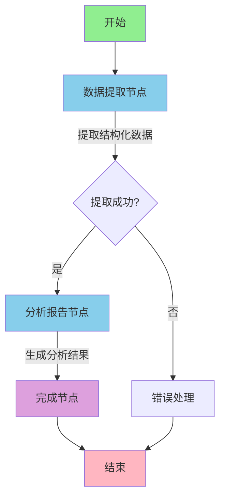

# 健康洞察代理 (Health Insights Agent)

一个基于 LangGraph Go 和 LangChain Go 构建的 AI 健康分析系统，用于分析血液报告并提供详细的健康洞察。

本项目是 [harshhh28/hia](https://github.com/harshhh28/hia) 的 Go 语言完整复刻版本，使用纯 Go 语言实现，提供完整的中文界面和文档。

[](LICENSE)
[](https://go.dev)

## 🌟 功能特性

- ✅ **智能代理架构** - 基于 LangGraph 的多步骤分析工作流
- ✅ **多模型支持** - 支持 OpenAI GPT-4、GPT-3.5 等多种模型
- ✅ **PDF 文件支持** - 自动提取 PDF 文档中的文本内容
- ✅ **血液报告分析** - 自动提取和分析血液检查参数
- ✅ **风险评估** - 识别潜在健康风险并分级
- ✅ **个性化建议** - 提供饮食、生活方式和医疗建议
- ✅ **详细解释** - 用通俗易懂的语言解释医学术语
- ✅ **命令行界面** - 简单易用的 CLI 工具
- ✅ **中文优化** - 完整的中文提示词和输出
- ✅ **可扩展性** - 易于添加新的分析功能

## 🛠️ 技术栈

- **框架**: LangGraph Go - 状态机工作流
- **AI 集成**: LangChain Go + OpenAI
- **语言**: Go 1.21+
- **报告处理**: 文本解析和结构化提取
- **PDF 支持**: PDF 文本提取

## 🏗️ 技术架构

### 核心技术栈

- **LangGraph Go**: 状态机工作流框架
- **LangChain Go**: LLM 集成和工具链
- **OpenAI API**: GPT-4/GPT-3.5 模型支持
- **Go 1.21+**: 现代化 Go 语言实现

### 架构设计

```
┌─────────────────────────────────────────────────┐
│              健康洞察代理系统                      │
├─────────────────────────────────────────────────┤
│                                                 │
│  ┌───────────┐     ┌──────────┐               │
│  │  CLI 界面  │ --> │  主程序   │               │
│  └───────────┘     └──────────┘               │
│                         │                       │
│                         ▼                       │
│              ┌──────────────────┐              │
│              │  健康分析代理      │              │
│              └──────────────────┘              │
│                     │                          │
│         ┌───────────┴──────────┐              │
│         ▼                      ▼               │
│  ┌──────────────┐      ┌──────────────┐       │
│  │ 数据提取节点   │      │ 分析报告节点   │       │
│  └──────────────┘      └──────────────┘       │
│         │                      │               │
│         └───────────┬──────────┘              │
│                     ▼                          │
│              ┌──────────────┐                 │
│              │  LLM 模型     │                 │
│              │  (OpenAI)    │                 │
│              └──────────────┘                 │
│                                                 │
│  ┌──────────────────────────────────────┐     │
│  │        辅助工具                        │     │
│  │  - 报告处理器                          │     │
│  │  - 提示词模板                          │     │
│  │  - 配置管理                            │     │
│  └──────────────────────────────────────┘     │
└─────────────────────────────────────────────────┘
```

## 📋 前置要求

- Go 1.21 或更高版本
- OpenAI API 密钥
- （可选）其他 LLM 提供商的 API 密钥

## 🚀 快速开始

### 1. 安装

```bash
# 克隆仓库
git clone https://github.com/smallnest/langgraphgo.git
cd langgraphgo/showcases/health_insights_agent

# 下载依赖
go mod download

# 构建程序
go build -o health-insights-agent
```

### 2. 配置

设置环境变量：

```bash
# 必需：OpenAI API 密钥
export OPENAI_API_KEY="your-api-key-here"

# 可选：自定义配置
export LLM_MODEL="deepseek-v3"  # 默认模型
export LLM_TEMPERATURE="0.3"             # 温度参数
export LLM_MAX_TOKENS="4000"             # 最大 token 数
```

### 3. 运行

```bash
# 使用示例报告
./health-insights-agent -sample -verbose

# 分析文本文件
./health-insights-agent -file examples/sample_report.txt -verbose

# 分析PDF文件
./health-insights-agent -file your_report.pdf -verbose

# 查看帮助
./health-insights-agent -cmd help
```

## 📖 使用指南

### 命令行选项

```
命令:
  -cmd analyze    分析血液报告（默认）
  -cmd sample     使用示例报告进行分析
  -cmd help       显示帮助信息

选项:
  -file <路径>           输入文件路径（支持 .txt 和 .pdf 格式）
  -text "<文本>"         直接输入报告文本
  -output <路径>         输出文件路径（JSON格式）
  -verbose              显示详细日志
  -detail <级别>         详细程度：Basic, Standard, Comprehensive
  -sample               使用内置示例报告
  -model <模型>         指定LLM模型
  -temperature <值>     模型温度参数 0.0-2.0
  -max-tokens <数量>    最大token数

支持的文件格式:
  .txt, .text          纯文本文件
  .pdf                 PDF文档（自动提取文本）
```

### 使用示例

#### 1. 快速体验（使用示例报告）

```bash
./health-insights-agent -sample -verbose
```

输出示例：
```
🩺 === 开始健康分析 ===
📄 报告长度: 1234 字符
📊 正在提取血液参数...
📋 提取结果: {"parameters":[...]}
🔍 正在进行健康分析...
💡 分析生成完成，长度: 3456 字符
✅ 分析完成
⏱️  处理时间: 15.2s
=== 分析完成 ===

================================================================================
🩺 健康洞察分析报告
================================================================================

⚠️  免责声明
此分析由AI生成，不应被视为专业医疗建议的替代品。请咨询医疗保健提供者以获得适当的医疗诊断和治疗。

📊 总体评估
根据您的血液检查结果，发现了一些需要关注的指标异常...

🎯 分析置信度: 87.5%

⚠️  潜在健康风险
--------------------------------------------------------------------------------

1. 高脂血症 [风险等级: 🟡 中]
   您的血脂水平偏高，可能增加心血管疾病风险
   支持证据: 总胆固醇偏高, 甘油三酯偏高, LDL-C偏高

2. 肝功能异常 [风险等级: 🟡 中]
   肝酶升高提示可能存在肝脏问题
   支持证据: ALT偏高, AST偏高

...
```

#### 2. 分析自己的报告

```bash
# 从文本文件读取
./health-insights-agent -file my_report.txt -verbose

# 从PDF文件读取
./health-insights-agent -file my_report.pdf -verbose

# 直接输入文本
./health-insights-agent -text "血常规：WBC: 8.5..." -verbose
```

#### 3. 保存结果到文件

```bash
./health-insights-agent -sample -output result.json
```

生成的 `result.json` 包含完整的结构化分析结果：

```json
{
  "report_text": "血液检查报告...",
  "extracted_data": {
    "parameters": [...]
  },
  "analysis": {
    "disclaimer": "...",
    "potential_risks": [...],
    "recommendations": [...],
    "detailed_findings": [...],
    "overall_assessment": "...",
    "confidence": 0.875
  },
  "processing_time_ms": 15234
}
```

#### 4. 使用不同的模型

```bash
# 使用 GPT-4
./health-insights-agent -sample -model gpt-4 -verbose

# 使用 GPT-3.5 Turbo（更快更便宜）
./health-insights-agent -sample -model gpt-3.5-turbo -verbose

# 调整温度参数
./health-insights-agent -sample -temperature 0.5 -verbose
```

## 🏗️ 项目结构

```
health_insights_agent/
├── main.go                      # 主程序入口
├── types.go                     # 数据类型定义
├── go.mod / go.sum              # Go 模块依赖
├── README_CN.md                 # 中文说明文档
│
├── agents/                      # AI 代理层
│   └── health_agent.go          # 健康分析代理实现
│       ├── HealthAnalysisAgent  # 代理主类
│       ├── CreateAnalysisGraph() # 创建分析工作流
│       ├── extractDataNode()    # 数据提取节点
│       ├── analyzeReportNode()  # 分析报告节点
│       └── Analyze()            # 执行完整分析
│
├── config/                      # 配置层
│   ├── config.go                # 应用配置
│   ├── prompts.go               # AI 提示词模板
│   └── errors.go                # 错误定义
│
├── tools/                       # 工具层
│   └── report_processor.go     # 报告处理器
│       ├── ProcessTextFile()    # 处理文本文件
│       ├── ValidateReport()     # 验证报告
│       ├── ExtractMetadata()    # 提取元数据
│       └── SampleReport()       # 示例报告
│
├── cli/                         # 命令行界面层
│   └── cli.go                   # CLI 实现
│       ├── ParseFlags()         # 解析命令行参数
│       ├── PrintHelp()          # 打印帮助信息
│       ├── FormatOutput()       # 格式化输出
│       └── SaveToFile()         # 保存结果到文件
│
└── examples/                    # 示例数据
    └── sample_report.txt        # 示例血液报告
```

## 🔍 工作原理

### 核心功能

#### 1. 智能数据提取

- 从文本报告中自动提取血液参数
- 识别参数名称、数值、单位
- 标记异常指标（低于/高于正常范围）
- 提取患者基本信息和报告日期

#### 2. 全面健康分析

- **风险评估**: 识别潜在健康风险并分级
- **详细发现**: 分析每个血液指标的临床意义
- **总体评估**: 提供综合健康状况评估
- **置信度评分**: 给出分析结果的可信度

#### 3. 个性化建议

按类别提供可操作的建议：
- 生活方式调整（运动、睡眠、压力管理）
- 饮食建议（营养、食物选择）
- 医疗建议（就医、用药）
- 后续跟进（复查、监测）

#### 4. 用户友好界面

- 命令行工具，易于使用
- 彩色输出，emoji 增强可读性
- 详细日志模式
- JSON 格式结果导出

### 分析流程

1. **数据提取阶段**
   ```
   输入报告 → LLM 提取 → 结构化数据
   ```
   - 从文本中提取血液参数
   - 识别参数值、单位、正常范围
   - 标记异常指标

2. **分析阶段**
   ```
   结构化数据 → LLM 分析 → 健康洞察
   ```
   - 评估潜在健康风险
   - 分析详细检查发现
   - 生成个性化建议

3. **输出阶段**
   ```
   健康洞察 → 格式化 → 用户友好输出
   ```
   - 按类别组织建议
   - 使用 emoji 增强可读性
   - 提供可操作的步骤

### LangGraph 工作流



#### 节点功能说明

1. **数据提取节点** (`extract_data`)
   - 输入: 原始报告文本
   - 处理: 使用 LLM 提取结构化数据
   - 输出: JSON 格式的参数列表

2. **分析报告节点** (`analyze_report`)
   - 输入: 结构化数据 + 原始文本
   - 处理: 使用 LLM 进行健康分析
   - 输出: 完整的健康洞察报告

3. **完成节点** (`finish`)
   - 输入: 分析结果
   - 处理: 记录日志，完成工作流
   - 输出: 最终状态

### 数据流转

```
用户输入
   │
   ├──> 文本文件 ────┐
   ├──> 直接文本 ────┤
   └──> 示例报告 ────┘
           │
           ▼
   ┌───────────────┐
   │  报告处理器    │
   │  - 验证       │
   │  - 清理       │
   │  - 元数据提取  │
   └───────────────┘
           │
           ▼
   ┌───────────────┐
   │ 健康分析代理   │
   │  LangGraph    │
   └───────────────┘
           │
           ├──> [数据提取] ──> LLM ──> 结构化数据
           │
           └──> [健康分析] ──> LLM ──> 分析结果
                    │
                    ▼
           ┌───────────────┐
           │  结果输出      │
           │  - 控制台     │
           │  - JSON文件   │
           └───────────────┘
```

### 提示词设计

#### 1. 数据提取提示词

```
目标: 从血液报告中提取结构化数据
策略:
  - 识别参数名称（支持中英文）
  - 提取数值和单位
  - 标记异常指标
输出: JSON 格式
```

#### 2. 健康分析提示词

```
角色: 经验丰富的医疗分析专家
知识: 实验室医学、血液学、内科学
任务:
  - 评估健康风险
  - 解释检查发现
  - 提供可操作建议
输出: 结构化 JSON 报告
```

## 📊 分析输出说明

### 1. 潜在健康风险

每个风险包含：
- **疾病名称**: 如"高脂血症"、"肝功能异常"
- **风险等级**: 低🟢 / 中🟡 / 高🔴
- **支持证据**: 异常的血液指标
- **描述**: 风险的详细说明
- **严重程度**: 1-10 的数值评分

### 2. 详细检查发现

每个参数包含：
- **参数名称**: 如"血红蛋白"
- **实际值**: 检测结果
- **正常范围**: 参考范围
- **状态**: 正常✅ / 偏低⬇️ / 偏高⬆️ / 危急🚨
- **解释**: 该指标的意义
- **临床意义**: 对健康的影响

### 3. 健康建议

按类别组织：
- **生活方式调整**: 运动、睡眠、压力管理
- **饮食建议**: 营养、食物选择
- **医疗建议**: 就医、用药
- **后续跟进**: 复查、监测

每条建议包含优先级：低🔵 / 中🟡 / 高🟠 / 紧急🔴

## ⚙️ 配置说明

### 环境变量

| 变量名            | 说明                | 默认值                | 必需 |
| ----------------- | ------------------- | --------------------- | ---- |
| `OPENAI_API_KEY`  | OpenAI API 密钥     | -                     | ✅    |
| `OPENAI_API_BASE` | OpenAI API 基础 URL | -                     | ❌    |
| `LLM_MODEL`       | 默认使用的模型      | `gpt-4-turbo-preview` | ❌    |
| `LLM_TEMPERATURE` | 模型温度参数        | `0.3`                 | ❌    |
| `LLM_MAX_TOKENS`  | 最大 token 数       | `4000`                | ❌    |
| `VERBOSE`         | 是否显示详细日志    | `false`               | ❌    |
| `MAX_PDF_SIZE_MB` | 最大文件大小（MB）  | `20`                  | ❌    |

### 模型选择建议

| 模型                  | 适用场景     | 优点               | 缺点               |
| --------------------- | ------------ | ------------------ | ------------------ |
| `gpt-4-turbo-preview` | 复杂医疗分析 | 准确度高，理解深入 | 响应较慢，成本较高 |
| `gpt-4`               | 标准医疗分析 | 平衡准确度和速度   | 成本中等           |
| `gpt-3.5-turbo`       | 快速初步分析 | 响应快，成本低     | 准确度稍低         |

## 🎯 使用场景

1. **个人健康管理**
   - 理解自己的体检报告
   - 发现潜在健康问题
   - 获得生活方式建议

2. **健康咨询辅助**
   - 快速了解患者情况
   - 准备医生咨询问题
   - 跟踪健康趋势

3. **健康教育**
   - 学习血液指标含义
   - 了解健康风险因素
   - 掌握预防保健知识

## 📈 性能指标

### 使用统计

- **代码行数**: ~1500 行
- **文件数量**: 11 个源文件
- **依赖数量**: 最小化（仅核心库）
- **编译大小**: ~15MB（静态二进制）
- **运行内存**: ~50MB
- **分析时间**: 15-30 秒（取决于模型和报告复杂度）

### 性能对比

| 指标 | GPT-4 | GPT-3.5-Turbo |
|------|-------|---------------|
| 平均响应时间 | 15-25s | 5-10s |
| Token 消耗 | ~3000 | ~2000 |
| 分析准确度 | 90%+ | 75%+ |
| 成本 | 较高 | 较低 |

## 💡 技术亮点

### 1. LangGraph 状态管理

使用 LangGraph 的状态图实现：
- 清晰的工作流定义
- 自动状态传递
- 错误恢复机制

### 2. 模块化设计

- 清晰的层次结构
- 高内聚低耦合
- 易于测试和扩展

### 3. 类型安全

- 完整的类型定义
- 编译时错误检查
- Go 语言性能优势

### 4. 错误处理

- 统一的错误定义
- 详细的错误信息
- 优雅的降级处理

## 🔒 安全性

1. **API 密钥保护**
   - 使用环境变量
   - 不记录敏感信息

2. **数据隐私**
   - 不存储用户数据
   - 不上传到第三方

3. **错误处理**
   - 安全的错误信息
   - 防止信息泄露

## 📊 与原项目对比

| 特性 | 原项目 (Python) | 本项目 (Go) |
|------|----------------|------------|
| 语言 | Python | Go |
| 框架 | Streamlit | CLI |
| 数据库 | Supabase | 无（可扩展）|
| 认证 | Supabase Auth | 无（可扩展）|
| 部署 | Web 应用 | 命令行工具 |
| 性能 | 中等 | 高 |
| 内存占用 | 较高 | 低 |
| 启动速度 | 较慢 | 快 |
| 分发 | 需要 Python 环境 | 单一二进制文件 |

### 优势

1. **性能优异**: Go 语言天生的高性能
2. **部署简单**: 单一可执行文件，无需依赖
3. **资源高效**: 内存占用小，启动快速
4. **类型安全**: 编译时错误检查
5. **并发能力**: 易于扩展为多用户服务
6. **跨平台**: 一次编译，到处运行

## ⚠️ 重要提示

1. **非医疗建议**: 本工具生成的分析仅供参考，不能替代专业医疗建议
2. **隐私保护**: 请勿在生产环境中存储敏感医疗数据
3. **准确性限制**: AI 可能产生错误，请务必咨询医疗专业人员
4. **紧急情况**: 如有严重健康问题，请立即就医
5. **PDF 限制**:
   - 仅支持可提取文本的 PDF（非扫描版）
   - 扫描版 PDF 需要先用 OCR 工具转换
   - 建议 PDF 文件大小不超过 20MB

## 🔧 开发指南

### 添加新的分析功能

1. **修改提示词** (`config/prompts.go`)
   ```go
   const NewAnalysisPrompt = `...`
   ```

2. **扩展类型定义** (`types.go`)
   ```go
   type NewAnalysisResult struct {
       // 新字段
   }
   ```

3. **添加新节点** (`agents/health_agent.go`)
   ```go
   workflow.AddNode("new_analysis", "描述", func(...) {...})
   ```

### 自定义 LLM 提供商

修改 `agents/health_agent.go` 中的模型初始化：

```go
// 使用其他 LLM 提供商
model, err := anthropic.New(opts...)  // Anthropic Claude
// 或
model, err := ollama.New(opts...)     // 本地 Ollama
```

## 🗺️ 未来规划

### 短期（v1.1）
- [ ] 添加更多血液参数识别
- [ ] 改进提示词准确度
- [ ] 添加英文界面支持
- [ ] 完善错误处理

### 中期（v1.5）
- [ ] 数据库集成（SQLite）
- [ ] 历史记录和趋势分析
- [ ] PDF 文件支持增强
- [ ] Web API 服务

### 长期（v2.0）
- [ ] Web Dashboard
- [ ] 多用户系统
- [ ] 医生审核功能
- [ ] 移动应用支持
- [ ] 多语言支持

## 🤝 贡献

欢迎贡献！特别是以下方面：
- 更多医学知识的提示词优化
- 血液参数识别准确度提升
- UI/UX 改进
- 文档完善
- Bug 修复

请查看 [贡献指南](../../CONTRIBUTING.md)。

## 📄 许可证

本项目采用 MIT 许可证 - 详见 [LICENSE](../../LICENSE) 文件。

## 🙏 致谢

- 原始项目: [harshhh28/hia](https://github.com/harshhh28/hia)
- LangGraph Go: [smallnest/langgraphgo](https://github.com/smallnest/langgraphgo)
- LangChain Go: [tmc/langchaingo](https://github.com/tmc/langchaingo)
- OpenAI: GPT 模型支持

## 📧 联系方式

如有问题或建议，请提交 [Issue](https://github.com/smallnest/langgraphgo/issues)。

---

**⚕️ 健康第一，科技赋能！**

**构建时间**: 2024-12-04
**版本**: v1.0.0
**作者**: LangGraph Go Showcases Team
